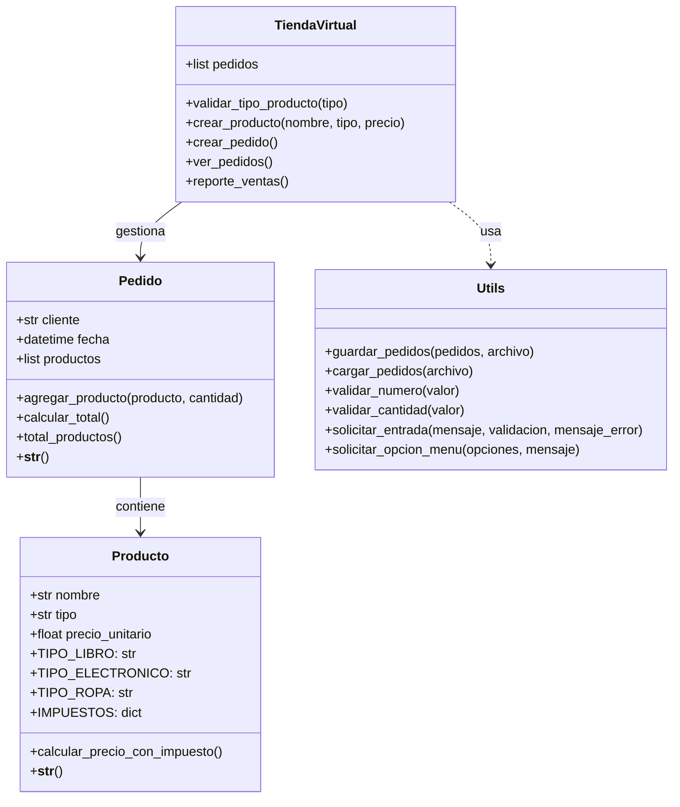
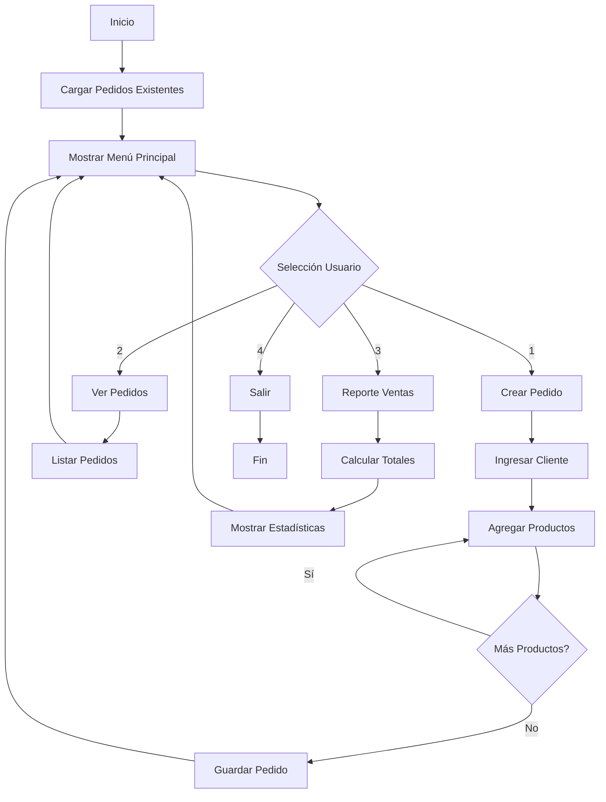

# Diagramas del Sistema de Gestión de Pedidos

## 1. Diagrama de Clases

## 2. Diagrama de Flujo

## Explicación de los Diagramas

### Diagrama de Clases
- **Producto**: Clase base que representa los productos con sus tipos e impuestos
  - Maneja tres tipos de productos: LIBRO, ELECTRONICO y ROPA
  - Calcula precios con impuestos según el tipo

- **Pedido**: Gestiona la información de un pedido y sus productos
  - Mantiene lista de productos y cantidades
  - Calcula totales y gestiona información del cliente

- **TiendaVirtual**: Clase principal que coordina todas las operaciones
  - Gestiona la creación y visualización de pedidos
  - Genera reportes de ventas

- **Utils**: Módulo con funciones de utilidad
  - Maneja persistencia de datos
  - Proporciona validaciones y entrada de usuario

### Diagrama de Flujo
1. **Inicio y Carga**
   - El programa inicia cargando pedidos existentes
   - Presenta menú principal

2. **Operaciones Principales**
   - Crear Pedido: Flujo de creación de nuevos pedidos
   - Ver Pedidos: Visualización de pedidos existentes
   - Reporte Ventas: Generación de estadísticas
   - Salir: Finalización del programa

3. **Ciclo de Vida**
   - Todas las operaciones regresan al menú principal
   - El programa continúa hasta que el usuario elige salir

## Características del Sistema

1. **Persistencia**
   - Almacenamiento en archivo de texto
   - Carga y guardado automático

2. **Validación**
   - Entrada de usuario validada
   - Manejo de errores robusto

3. **Reportes**
   - Totales de ventas
   - Estadísticas por tipo de producto
   - Pedido más grande

4. **Interfaz**
   - Menú basado en consola
   - Navegación intuitiva
   - Mensajes claros al usuario 